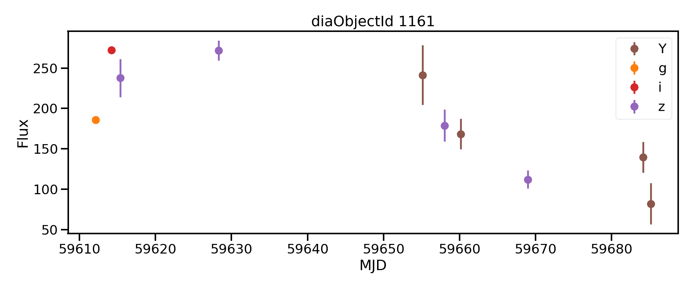

!!! info
when: 02/03/2022
where: Fink Kafka server @ VirtualData
who: Julien @ IJCLab
!!!

In this note, I show how to simulate a stream of alerts based on ELaSTICC data, and how to consume it.

!!! note Requirements:
- A running Kafka server (tested with Kafka 2.1.0).
- Python 3 (tested with 3.7.11)
- [fink-alert-simulator](https://github.com/astrolabsoftware/fink-alert-simulator) version 0.2.0+
- [plasticc_alerts](https://github.com/LSSTDESC/plasticc_alerts) (no package version provided -- but data under elasticc.v0_9)
- `fastavro` (tested with 1.4.7), `confluent_kafka` (tested with 1.7.0)
!!!

## Preparing alerts

Download the subset of alerts available at https://github.com/LSSTDESC/plasticc_alerts/tree/main/tests/test01, and put it under `/data`. Decompress the folder, and decompress each `NITE` folder:

```bash
#!/bin/bash
set -e

cd /data/LSST_ALERTS_BATCH/ALERTS

# list the NITE folders
list_of_tar=`/usr/bin/ls -1 | grep .tar.gz`

mkdir -p bad

for atar in ${list_of_tar[@]}; do
    # Name for the temporary folder to decompress data
    folder=$(echo $atar | cut -d'.' -f1)

    # decompress data -- skip if untar fails
	  # You need pigz installed
    mkdir -p $folder
    if ! pigz -dc $atar | tar xf - ; then
        echo "Failed $atar"
        rm -rf $folder
        mv $atar bad/
        continue
    fi
done
```

Gather all alerts in one place:

```bash
#!/bin/bash
set -e

cd /data/LSST_ALERTS_BATCH/ALERTS

mkdir -p gathered

# list the ztf_public folders
list_of_alerts=`/usr/bin/ls -1 NITE* | grep '.*avro.gz'`

for alert in ${list_of_alerts[@]}; do
    cp NITE*/$alert gathered/
done

echo `/usr/bin/ls -1 gathered | wc` alerts
```

## Producing an alert stream

Now you need a running Kafka cluster, and [fink-alert-simulator](https://github.com/astrolabsoftware/fink-alert-simulator) version 0.2.0+. 

!!! tip Arg, Kafka?
if you are lazy, [fink-alert-simulator](https://github.com/astrolabsoftware/fink-alert-simulator) provides a way to spin up one with Docker.
!!!

Clone the repository on the machine where Kafka is running:

```bash
git clone https://github.com/astrolabsoftware/fink-alert-simulator.git
```

Update your `PYTHONPATH` and `PATH` to use the tools:

```bash
# in your ~/.bash_profile
export FINK_ALERT_SIMULATOR=/path/to/fink-alert-simulator
export PYTHONPATH=$FINK_ALERT_SIMULATOR:$PYTHONPATH
export PATH=$FINK_ALERT_SIMULATOR/bin:$PATH
```

Enter `fink-alert-simulator`.  You first need to edit the configuration file in `conf/` with the Kafka IPs (`KAFKA_IPPORT`), a topic name of your choice (`KAFKA_TOPIC`), and the path to the folder that contains the gzipped alerts (`FINK_DATA_SIM`, in our case this is `/data/LSST_ALERTS_BATCH/ALERTS/gathered`).

Then, let's simulate a very small stream made of 3 observations separated by 1 second each. Each observation will contain 5 alerts:

```bash
# Which alert field to display on the screen to follow the stream progression
DISPLAY_FIELD=diaSource,midPointTai

# Number of alerts to send simultaneously per observation
NALERTS_PER_OBS=5

# Number of observations to make. Note that the total
# number of alerts will be NALERTS_PER_OBS * NOBSERVATIONS
# Set it to -1 if you want all alerts to be sent.
NOBSERVATIONS=3

# Time between 2 observations (second)
TIME_INTERVAL=1
```

You should see the stream progression on your screen:

```bash
[centos@kafka-master fink-alert-simulator]$ fink_simulator -c conf/fink_alert_simulator_elasticc.conf
Reading custom configuration file from  conf/fink_alert_simulator_elasticc.conf
Total alert available (/data/LSST_ALERTS_BATCH/ALERTS/gathered): 5693
Total alert to be sent: 15
t0: 1646209314.7304435
Observation start: t0 + : 0.27 seconds
5 alerts sent (59582.0513 to 59583.0511)
Observation 1 done...
Observation start: t0 + : 1.27 seconds
5 alerts sent (59583.0511 to 59588.1079)
Observation 2 done...
Observation start: t0 + : 2.27 seconds
5 alerts sent (59588.1079 to 59590.0349)
Observation 3 done...
```

Alerts are ordered by time (earliest first). Note that we print the field `midPointTai` from `diaSource`. Several alerts have the same `midPointTai`, but you can check these are not the same alerts by printing the `diaSourceId` instead:

```bash
...
5 alerts sent (2260000 to 2262001)
...
5 alerts sent (2268001 to 1612001)
...
5 alerts sent (1686001 to 1686002)
...
```

Good! Now we have some alerts available in the topic `$KAFKA_TOPIC`.

## Consuming the alert stream

Now, let's consume the stream. Open a file called `poll_one_alert_elasticc.py` and insert:

```python
import io
import sys
import json
import fastavro
import confluent_kafka

def poll(schema_path: str) -> None:
    """ Poll one Elasticc alert from Fink servers

    Parameters
    ----------
    schema_path: str
        Path to ELaSTICC schema on disk
    """
    # Get the schema
    schema = fastavro.schema.load_schema(schema_path)

    # Basic configuration
    kafka_config = {
        "group.id": "toto",
        "bootstrap.servers": "xx.xx.xx.xx:yy",
        "auto.offset.reset": "earliest"
    }

    # Instantiate a consumer
    consumer = confluent_kafka.Consumer(kafka_config)

    # Subscribe to topic
    topics = ['my_topic_defined_earlier']
    consumer.subscribe(topics)

    # Poll
    timeout_second = 5
    msg = consumer.poll(timeout_second)

    # Decode the message
    if msg is not None:
        alert = fastavro.schemaless_reader(io.BytesIO(msg.value()), schema)

        with open(str(alert['diaSource']['diaObjectId']) + '.avro', 'wb') as out:
            fastavro.writer(out, schema, [alert])
    else:
        alert = None

    print(json.dumps(alert, indent=4, sort_keys=True))

    consumer.close()


if __name__ == "__main__":

    if len(sys.argv) != 2:
        print("Usage: python poll_one_alert_elasticc.py <path_to_elasticc_schema>")
        sys.exit(1)

    schema_path = sys.argv[1]

    poll(schema_path)


```

!!! danger Which group ID to use?
You do not need any authentification to consume, except a unique group ID. So change `toto` into something unique (yes, something only you can think of -- please no `test`, `foo`, `bar`, `toto`, and so on).
!!!

!!! info What is the server address?
You need to use the same server address as defined in your Kafka configuration earlier (`KAFKA_IPPORT`). To use the one for DESC, ask me.
!!!

You will need the alert schema as well. For this, clone the plasticc_alert repository, and set the path to the provided schema:

```bash
git clone https://github.com/LSSTDESC/plasticc_alerts
SCHEMAPATH=/path/plasticc_alerts/Examples/plasticc_schema/elasticc.v0_9.alert.avsc
```

And here is the result on one random alert:

```json
python poll_one_alert_elasticc.py $SCHEMAPATH
{
	"alertId": 1231321321,
	"cutoutDifference": null,
	"cutoutTemplate": null,
	"diaObject": {
		"decl": -23.643314,
		"diaObjectId": 1161,
		"hostgal2_dec": 0.0,
		"hostgal2_ellipticity": 0.0,
		"hostgal2_mag_Y": 999.0,
		"hostgal2_mag_g": 999.0,
		"hostgal2_mag_i": 999.0,
		"hostgal2_mag_r": 999.0,
		"hostgal2_mag_u": 999.0,
		"hostgal2_mag_z": 999.0,
		"hostgal2_magerr_Y": 999.0,
		"hostgal2_magerr_g": 999.0,
		"hostgal2_magerr_i": 999.0,
		"hostgal2_magerr_r": 999.0,
		"hostgal2_magerr_u": 999.0,
		"hostgal2_magerr_z": 999.0,
		"hostgal2_ra": 0.0,
		"hostgal2_snsep": -9.0,
		"hostgal2_sqradius": 0.0,
		"hostgal2_z": -9.0,
		"hostgal2_z_err": -9.0,
		"hostgal2_zphot_q10": -9.0,
		"hostgal2_zphot_q20": -9.0,
		"hostgal2_zphot_q30": -9.0,
		"hostgal2_zphot_q40": -9.0,
		"hostgal2_zphot_q50": -9.0,
		"hostgal2_zphot_q60": -9.0,
		"hostgal2_zphot_q70": -9.0,
		"hostgal2_zphot_q80": -9.0,
		"hostgal2_zphot_q90": -9.0,
		"hostgal2_zphot_q99": -9.0,
		"hostgal_dec": 0.0,
		"hostgal_ellipticity": 0.0,
		"hostgal_mag_Y": 22.970932006835938,
		"hostgal_mag_g": 26.076929092407227,
		"hostgal_mag_i": 23.888652801513672,
		"hostgal_mag_r": 24.886838912963867,
		"hostgal_mag_u": 26.723251342773438,
		"hostgal_mag_z": 23.18714141845703,
		"hostgal_magerr_Y": 0.03017125464975834,
		"hostgal_magerr_g": 0.09962014108896255,
		"hostgal_magerr_i": 0.018383672460913658,
		"hostgal_magerr_r": 0.03079664707183838,
		"hostgal_magerr_u": 0.6516252756118774,
		"hostgal_magerr_z": 0.01686723530292511,
		"hostgal_ra": 0.0,
		"hostgal_snsep": 0.15771415829658508,
		"hostgal_sqradius": 0.0,
		"hostgal_z": 0.9469579458236694,
		"hostgal_z_err": 0.0010000000474974513,
		"hostgal_zphot_q10": 0.11193337291479111,
		"hostgal_zphot_q20": 0.33731213212013245,
		"hostgal_zphot_q30": 0.49204882979393005,
		"hostgal_zphot_q40": 0.37921416759490967,
		"hostgal_zphot_q50": 0.577612578868866,
		"hostgal_zphot_q60": 0.4752698838710785,
		"hostgal_zphot_q70": 0.2928799092769623,
		"hostgal_zphot_q80": 0.7956398725509644,
		"hostgal_zphot_q90": 0.8683863878250122,
		"hostgal_zphot_q99": 0.04459336772561073,
		"mwebv": 0.0,
		"mwebv_err": 0.0,
		"ra": 157.324219,
		"z_final": 0.0,
		"z_final_err": 0.0
	},
	"diaSource": {
		"ccdVisitId": 111111,
		"decl": -23.643314,
		"diaObjectId": 1161,
		"diaSourceId": 2322014,
		"filterName": "Y",
		"midPointTai": 59685.1517,
		"nobs": 73.0,
		"parentDiaSourceId": null,
		"psFlux": 81.89139556884766,
		"psFluxErr": 25.564889907836914,
		"ra": 157.324219,
		"snr": 41.099998474121094
	},
	"prvDiaForcedSources": null,
	"prvDiaNondetectionLimits": null,
	"prvDiaSources": [
		{
			"ccdVisitId": 111111,
			"decl": -23.643314,
			"diaObjectId": 1161,
			"diaSourceId": 2322005,
			"filterName": "g",
			"midPointTai": 59612.1412,
			"nobs": 73.0,
			"parentDiaSourceId": null,
			"psFlux": 185.86163330078125,
			"psFluxErr": 1.532784104347229,
			"ra": 157.324219,
			"snr": 41.099998474121094
		},
		{
			"ccdVisitId": 111111,
			"decl": -23.643314,
			"diaObjectId": 1161,
			"diaSourceId": 2322006,
			"filterName": "i",
			"midPointTai": 59614.2177,
			"nobs": 73.0,
			"parentDiaSourceId": null,
			"psFlux": 272.3638610839844,
			"psFluxErr": 4.036244869232178,
			"ra": 157.324219,
			"snr": 41.099998474121094
		},
		{
			"ccdVisitId": 111111,
			"decl": -23.643314,
			"diaObjectId": 1161,
			"diaSourceId": 2322007,
			"filterName": "z",
			"midPointTai": 59615.3724,
			"nobs": 73.0,
			"parentDiaSourceId": null,
			"psFlux": 237.74720764160156,
			"psFluxErr": 23.578020095825195,
			"ra": 157.324219,
			"snr": 41.099998474121094
		},
		{
			"ccdVisitId": 111111,
			"decl": -23.643314,
			"diaObjectId": 1161,
			"diaSourceId": 2322008,
			"filterName": "z",
			"midPointTai": 59628.3135,
			"nobs": 73.0,
			"parentDiaSourceId": null,
			"psFlux": 271.8919982910156,
			"psFluxErr": 12.404321670532227,
			"ra": 157.324219,
			"snr": 41.099998474121094
		},
		{
			"ccdVisitId": 111111,
			"decl": -23.643314,
			"diaObjectId": 1161,
			"diaSourceId": 2322009,
			"filterName": "Y",
			"midPointTai": 59655.1187,
			"nobs": 73.0,
			"parentDiaSourceId": null,
			"psFlux": 241.3377227783203,
			"psFluxErr": 36.98511505126953,
			"ra": 157.324219,
			"snr": 41.099998474121094
		},
		{
			"ccdVisitId": 111111,
			"decl": -23.643314,
			"diaObjectId": 1161,
			"diaSourceId": 2322010,
			"filterName": "z",
			"midPointTai": 59658.0153,
			"nobs": 73.0,
			"parentDiaSourceId": null,
			"psFlux": 178.9302520751953,
			"psFluxErr": 19.760738372802734,
			"ra": 157.324219,
			"snr": 41.099998474121094
		},
		{
			"ccdVisitId": 111111,
			"decl": -23.643314,
			"diaObjectId": 1161,
			"diaSourceId": 2322011,
			"filterName": "Y",
			"midPointTai": 59660.1877,
			"nobs": 73.0,
			"parentDiaSourceId": null,
			"psFlux": 168.4271240234375,
			"psFluxErr": 19.094131469726562,
			"ra": 157.324219,
			"snr": 41.099998474121094
		},
		{
			"ccdVisitId": 111111,
			"decl": -23.643314,
			"diaObjectId": 1161,
			"diaSourceId": 2322012,
			"filterName": "z",
			"midPointTai": 59668.9953,
			"nobs": 73.0,
			"parentDiaSourceId": null,
			"psFlux": 112.05487823486328,
			"psFluxErr": 11.083906173706055,
			"ra": 157.324219,
			"snr": 41.099998474121094
		},
		{
			"ccdVisitId": 111111,
			"decl": -23.643314,
			"diaObjectId": 1161,
			"diaSourceId": 2322013,
			"filterName": "Y",
			"midPointTai": 59684.1418,
			"nobs": 73.0,
			"parentDiaSourceId": null,
			"psFlux": 139.5853271484375,
			"psFluxErr": 19.207176208496094,
			"ra": 157.324219,
			"snr": 41.099998474121094
		}
	]
}
```

Bingo! You can even plot the resulting lightcurve:



## Concretely for DESC

I set up a test topic for DESC using the data in the plasticc_alerts repo. Ask me if you want to access it.

## Remarks

1. Alerts are mostly empty.
2. `alertId` are all the same, and equal to `1231321321`.
